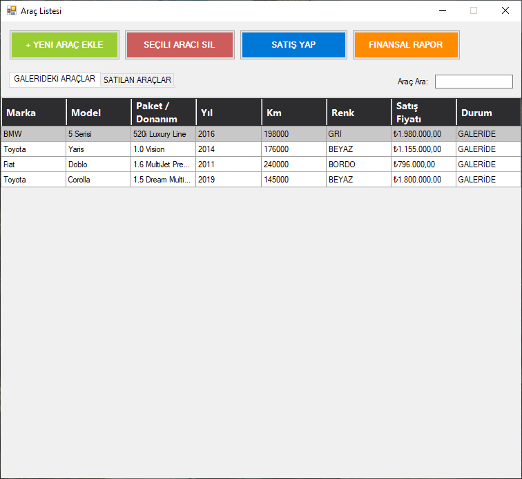
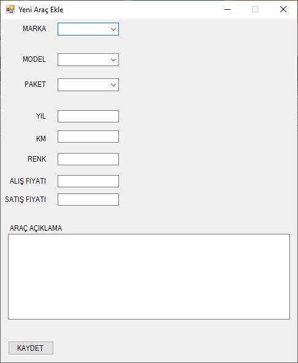
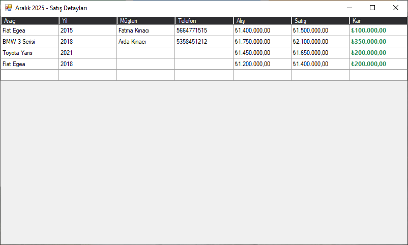

# 🚗 Oto Galeri Otomasyon Sistemi

   

Bu proje, bir oto galerinin araç alım-satım süreçlerini, stok takibini ve finansal raporlamalarını yönetmek amacıyla **C# Windows Forms** ve **MS SQL Server** kullanılarak geliştirilmiştir. Proje, sürdürülebilirlik ve temiz kod prensipleri gözetilerek **Katmanlı Mimari (N-Tier Architecture)** yapısında inşa edilmiştir.

---

### 📸 Ekran Görüntüleri

  
  &nbsp; &nbsp; &nbsp;
  
  &nbsp; &nbsp; &nbsp;
  

---

## 🚀 Özellikler

### 🔐 Yetkilendirme
* **Admin Girişi:** Kullanıcı adı ve şifre ile güvenli giriş sistemi.

### 🚙 Araç Yönetimi (CRUD)
* **Araç Ekleme/Silme/Güncelleme:** Araçların marka, model, yıl, fiyat ve durum bilgilerinin yönetimi.
* **Detaylı Listeleme:** Özelleştirilmiş DataGridView tasarımı ile araçların listelenmesi.
* **Arama ve Filtreleme:** Araçlar arasında hızlı arama yapabilme.

### 💰 Satış İşlemleri
* **Satış Modülü:** Müşteri bilgileri girilerek satışın gerçekleştirilmesi.
* **Stoktan Düşme:** Satılan aracın otomatik olarak stoktan düşülmesi ve pasif duruma getirilmesi.
* **Kar/Zarar Hesabı:** Alış ve satış fiyatı üzerinden anlık kar hesaplaması.

### 📊 Finansal Raporlama ve Dashboard
* **Dashboard Kartları:** Toplam Ciro, Toplam Kar ve Satılan Araç sayısının anlık gösterimi.
* **Aylık Analiz Tablosu:** Satışların aylara göre gruplanarak listelenmesi.
* **Drill-Down (Detay) Özelliği:** Rapor tablosunda ilgili aya çift tıklandığında, o ay yapılan satışların detay penceresinin açılması.

---

## 🛠 Teknik Detaylar ve Mimari

Proje **3 Katmanlı Mimari (3-Tier Architecture)** prensiplerine uygun olarak geliştirilmiştir:

1.  **Data Access Layer (DAL):** Veritabanı bağlantısı (`SqlHelper`) ve CRUD sorgularının bulunduğu katman. ADO.NET kullanılmıştır.
2.  **Business Logic Layer (BLL):** Veri doğrulama, hesaplama ve iş mantığının yürütüldüğü katman.
3.  **Presentation Layer (UI):** Kullanıcı arayüzü, formlar ve görsel tasarım.

* **Veritabanı:** MS SQL Server
* **ORM/Veri Erişimi:** ADO.NET (Saf SQL sorguları ile performans optimizasyonu)
* **Konfigürasyon:** `App.config` üzerinden dinamik bağlantı yönetimi (Connection String).

---

## 👨‍💻 Geliştirici

**Göktan Arda Kınacı** 
